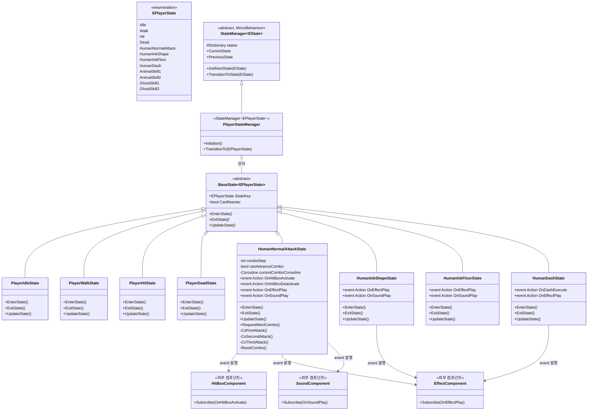
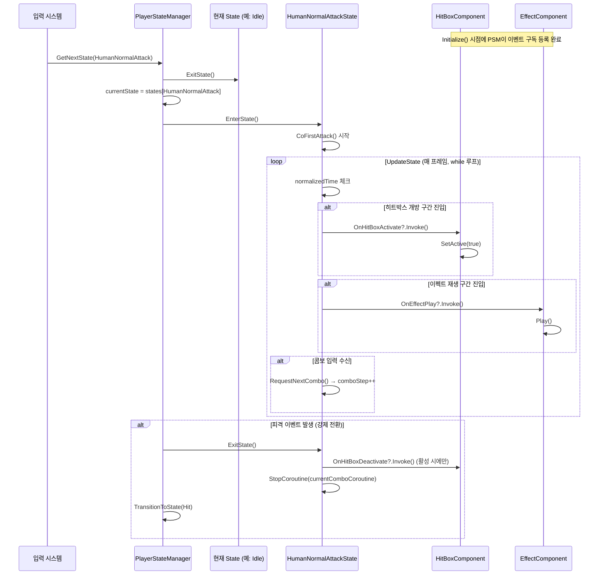

# 설계 문서: PlayerStateSystem

> 작성일: 2026-04-14
> 설계 담당: 설계 에이전트 (Claude Sonnet 4.6)
> 참고 분석 문서:
> - Analysis_PlayerState.md
> - Analysis_PlayerController.md
> - Analysis_PlayerMovement.md
> - Analysis_PlayerAnimation.md
> - Analysis_HumanMaskSkill.md
> - Analysis_PlayerSkill.md
> - Analysis_PlayerSkillMove.md
> - Analysis_PlayerDamageReaction.md
> - Analysis_Player.md

---

## 1. 클래스 다이어그램 (Mermaid)



---

## 2. 설계 의도 및 판단 근거

### 핵심 결정 사항

#### 결정 1: IPlayerContext 제거 — State와 외부 시스템 간 통신은 event/Action으로

`StateManager`는 `State`를 직접 생성하고 보유한다. 즉 `StateManager`와 `State` 사이는 이미 직접 의존 관계다. 이 상황에서 `IPlayerContext`를 도입해 State 안에서 간접 접근을 만들어도, 실질적인 결합도는 줄어들지 않는다. `StateManager`가 `State`를 생성할 때 Context를 주입하는 시점부터 State는 이미 구체 시스템에 묶인다.

대신 State 클래스는 외부 시스템(HitBox, Effect, Sound, Movement 등)에 직접 참조를 갖지 않는다. State는 "무언가를 실행시켜야 한다"는 신호를 `event Action`으로 발행하고, 외부 컴포넌트가 이 이벤트를 구독해 실제 동작을 수행한다.

```
// State 클래스 내부 예시
public event Action OnHitBoxActivate;
public event Action OnHitBoxDeactivate;

// UpdateState() 내부
if (normalizedTime >= hitBoxOpenThreshold && !hitBoxActive)
{
    hitBoxActive = true;
    OnHitBoxActivate?.Invoke();
}
```

```
// 외부 HitBoxComponent에서
attackState.OnHitBoxActivate += () => hitBox.SetActive(true);
attackState.OnHitBoxDeactivate += () => hitBox.SetActive(false);
```

이 구조에서 State는 외부 시스템을 모른다. State의 테스트 시 이벤트 구독 여부만 확인하면 되며, HitBox 구현이 바뀌어도 State 코드를 건드릴 필요가 없다.

#### 결정 2: 중단 책임은 ExitState()와 외부 시스템에 분리

State가 `OnHitBoxDeactivate` 이벤트를 발행하는 시점은 두 가지다:
- 애니메이션 normalizedTime이 히트박스 종료 구간에 도달했을 때 (State 내부에서 `Invoke`)
- 외부 FSM이 강제 전환할 때 `ExitState()` 내부에서 `OnHitBoxDeactivate?.Invoke()`

즉 State는 "켜라" 신호와 "꺼라" 신호를 모두 발행하며, 외부 컴포넌트는 구독만 한다. 중단 로직이 외부 컴포넌트 안에 있지 않고 State의 `ExitState()`에 명시적으로 존재한다.

#### 결정 3: 콤보 공격 — 단일 클래스 (`HumanNormalAttackState`) 내부 관리

콤보 3단계(1타, 2타, 3타)를 각각 별도 State 클래스로 분리하는 대신, `HumanNormalAttackState` 하나가 내부 `comboStep` 필드로 현재 단계를 관리한다.

채택 이유:
- 콤보 단계 간 전환은 외부 FSM이 아니라 연속 입력 타이밍에 의존한다. FSM 전환으로 표현하면 콤보 윈도우(입력 받을 수 있는 시간) 관리가 FSM 레벨로 올라와 오히려 복잡해진다.
- 3단계 모두 `HUMAN_NORMALATTACK` 상태라는 동일한 외부 정체성을 가진다. FSM 입장에서 별개의 상태일 이유가 없다.
- 콤보 진행 중 히트, 데드 등 외부 중단 이벤트는 FSM이 `HumanNormalAttackState`에서 다른 State로 전환하면 자동으로 `ExitState()`가 호출되어 정리된다.

#### 결정 4: Trigger 콜백 제거

기존 `BaseState`는 `OnTriggerEnter`, `OnTriggerStay`, `OnTriggerExit`를 추상 메서드로 강제했다. 이는 State가 물리 콜백에 직접 응답하도록 결합시키며, 물리 이벤트를 다루지 않는 상태(Idle, Walk 등)에서 빈 메서드 구현을 강요한다.

이번 설계에서는 Trigger 콜백을 `BaseState`에서 제거한다. 히트박스 충돌 처리는 전용 HitBoxComponent가 담당하고, State는 히트박스를 켜고 끄는 event만 발행한다.

---

### 채택한 디자인 패턴

| 패턴 | 적용 위치 | 적용 이유 |
|------|----------|---------|
| State 패턴 | `BaseState`, `PlayerStateManager` | 상태별 로직 캡슐화, 전환 조건 단일화 |
| Observer 패턴 (event/Action) | 각 State 클래스의 public event | State가 외부 시스템을 모른 채 신호 발행 가능 |
| Template Method | `BaseState` 추상 클래스 | EnterState/UpdateState/ExitState 실행 순서 강제 |

---

### 검토했으나 기각한 대안

#### 기각 대안 1: IPlayerContext 유지 (의존성 역전 인터페이스)

State 클래스가 `IPlayerContext`를 생성자 주입받아 내부에서 `context.HitBox.Activate()` 형태로 외부 시스템을 직접 호출하는 방식.

기각 이유:
- `StateManager`가 `State`를 직접 생성하는 구조에서, `IPlayerContext`를 추가해봤자 State와 외부 시스템 간 직접 의존은 사라지지 않는다. `StateManager`가 `IPlayerContext` 구현체를 생성하고 State에 넘기는 시점에 이미 결합이 일어난다.
- 인터페이스 추상화 계층이 하나 더 생기면서 코드 추적 경로가 길어지고, 실제 이득이 없다.
- 구현 담당자가 이 대안을 다시 선택하려 한다면, `StateManager`가 `State`를 생성하지 않는 구조(예: 외부 DI 컨테이너)를 함께 설계한 뒤 진행해야 한다.

#### 기각 대안 2: 콤보 3단계를 각각 별도 State 클래스로 분리

`HumanFirstAttackState`, `HumanSecondAttackState`, `HumanThirdAttackState`를 각각 만드는 방식.

기각 이유:
- 콤보 윈도우(2타 입력 가능 시간)를 FSM 전환 타이밍으로 표현해야 하는데, 이는 FSM 레벨에 타이밍 로직이 침투하는 것이다. State가 언제 다음 State로 전환할 수 있는지 판단하려면 결국 내부 bool 플래그나 타이머가 필요해 복잡도가 줄지 않는다.
- 3개 클래스가 Attack 공통 로직(이펙트 재생, 히트박스 제어, 사운드)을 중복 보유하거나, 공통 추상 기반 클래스를 또 하나 추가해야 한다. 계층이 불필요하게 깊어진다.
- 구현 담당자가 이 대안을 선택하고 싶을 경우, 위 두 문제를 먼저 해결하는 방안을 설계한 뒤 진행할 것.

#### 기각 대안 3: 기존 구조 유지 (HumanMaskSkill 단일 거대 클래스)

기각 이유:
- 스킬 4개(NormalAttack, InkShape, InkFloor, Dash), 코루틴 6개, bool 플래그 10개 이상이 하나의 클래스에 공존한다. 단일 책임 원칙을 위반한다.
- 스킬 하나를 수정할 때 다른 스킬 로직을 건드릴 위험이 상시 존재한다.
- 테스트가 불가능하다.

#### 기각 대안 4: MonoBehaviour 기반 상태 클래스 (각 상태를 별도 컴포넌트로 부착)

기각 이유:
- 상태 수만큼 GameObject에 컴포넌트가 붙어 Inspector가 오염된다.
- 상태 전환 시 컴포넌트 활성화/비활성화 오버헤드가 발생한다.
- 이미 기존 코드베이스에 `BaseState<Estate>`(순수 C# 클래스)와 `StateManager<EState>`(MonoBehaviour) 분리 구조가 존재하므로 이를 계승하는 것이 일관성 면에서 유리하다.

---

## 3. 문제점/단점/주의사항

#### [이벤트 구독 등록·해제 책임 소재 불명확]
- **문제**: State의 event를 누가, 언제, 어디서 구독하고 해제하는지 설계 계약이 없다. 구독은 `PlayerStateManager.Initialize()` 시점에 하는지, 각 외부 컴포넌트의 `Awake/Start`에서 하는지 명확하지 않다.
- **근거**: 구독이 누락되면 State가 이벤트를 발행해도 아무 동작도 일어나지 않아 히트박스가 열리지 않거나 이펙트가 재생되지 않는 버그가 발생한다. 반대로 해제가 누락되면 State 인스턴스가 교체된 후에도 이전 참조가 살아있어 GC 누수가 발생한다.
- **그럼에도 채택한 이유**: event/Action 방식이 State와 외부 시스템의 결합을 끊는 현재 구조에서 가장 단순한 방법이다. 대안(메시지 버스, 글로벌 이벤트 시스템)은 과설계다.
- **완화 방법**: 구독/해제는 `PlayerStateManager.Initialize()`에서 일괄 수행하도록 구현 가이드에 명시한다. State 인스턴스는 FSM 수명 동안 교체되지 않으므로(딕셔너리에 고정), 구독 후 해제 시점은 `PlayerStateManager.OnDestroy()`다.

#### [이벤트 발행 시점 보장 없음 (ExitState 누락 시 히트박스 미해제)]
- **문제**: State가 `OnHitBoxActivate`를 발행한 뒤, `ExitState()`에서 `OnHitBoxDeactivate`를 발행하지 않으면 히트박스가 영구 활성 상태로 남는다. 이는 구현 실수로 발생하기 쉬운 버그다.
- **근거**: 코루틴이 실행 중인 상태에서 FSM이 외부 이벤트(피격, 사망)로 강제 전환되면 코루틴은 즉시 중단된다. 코루틴이 `OnHitBoxDeactivate`를 발행하기 전에 중단되면 히트박스가 열린 채로 남는다. `ExitState()`가 이를 보완해야 하는데, 구현 담당자가 이를 누락하는 경우가 많다.
- **그럼에도 채택한 이유**: 이벤트 기반 소통 자체가 이 문제를 만드는 것이 아니라, 어떤 소통 방식이든 강제 전환 시 정리 책임은 존재한다. event/Action이 직접 참조 방식보다 이 문제를 더 악화시키지는 않는다.
- **완화 방법**: `ExitState()` 구현 규칙으로 "활성화 이벤트를 발행했다면 반드시 비활성화 이벤트를 발행하고 종료한다"를 구현 가이드에 명시한다. 히트박스 상태를 bool 플래그로 추적하고, `ExitState()`에서 `if (hitBoxActive) OnHitBoxDeactivate?.Invoke()`를 강제한다.

#### [HumanNormalAttackState 콤보 로직 복잡도]
- **문제**: 콤보 3단계를 단일 클래스에서 관리하면 `comboStep`, `canAdvanceCombo`, `currentComboCoroutine`, 각 단계별 타이밍 변수 등이 한 클래스 안에 집적된다. 단계가 추가될수록 내부 switch/if 분기가 증가한다.
- **근거**: 원본 `CoFirstAttack`, `CoSecondAttack`, `CoThirdAttack` 각각 40~50줄의 while 루프를 포함한다. 이를 단일 클래스에서 관리하면 클래스 길이가 150줄 이상이 된다. 읽기 어렵다.
- **그럼에도 채택한 이유**: 콤보 단계 전환이 FSM 레벨이 아닌 입력 타이밍 레벨에 속한다는 설계 판단. 외부 FSM에서 보면 "공격 중"이라는 단일 상태다.
- **완화 방법**: 각 단계 코루틴(`CoFirstAttack` 등)을 private 메서드로 명확히 분리하고, `comboStep`에 따른 분기를 `switch` 식(expression) 하나로 통일한다. 콤보 단계 데이터(애니메이션 키, 이동 데이터, 히트박스 개폐 타이밍)를 `ComboStepData[]` 배열로 분리하면 코드 중복을 줄일 수 있다.

#### [상태 전환 중 코루틴 누수]
- **문제**: 코루틴이 실행 중인 상태에서 FSM이 외부 이벤트(피격, 사망)로 강제 전환되면, `ExitState()`에서 코루틴을 명시적으로 중단하지 않으면 코루틴이 계속 실행된다. 특히 `while` 루프 기반 코루틴은 애니메이션 상태를 폴링하므로, 상태가 전환된 후에도 애니메이션 조건이 맞으면 루프를 계속 순회한다.
- **근거**: 원본 `HumanMaskSkill.InitializeCoroutine()`이 명시적으로 6개 코루틴을 null 체크 후 StopCoroutine 하는 이유가 정확히 이 문제 때문이다.
- **그럼에도 채택한 이유**: 코루틴 기반 스킬 로직이 애니메이션 클립 종료를 기다리는 가장 직관적인 방법이다. 애니메이션 이벤트 기반으로 대체할 수 있지만 그 경우 State와 Animator 간 커플링이 발생한다.
- **완화 방법**: `ExitState()`에서 반드시 현재 실행 중인 모든 코루틴을 `StopCoroutine`으로 중단한다. 코루틴 참조 변수를 nullable로 명시적으로 관리한다.

#### [while 루프 기반 폴링의 프레임 낭비]
- **문제**: 원본 코드의 스킬 코루틴은 `while(현재애니메이션 == 기대애니메이션)` 형태로 매 프레임 Animator 해시를 조회한다. 복잡한 스킬 여러 개가 동시에 코루틴을 실행하면 매 프레임 다수의 `GetCurrentAnimatorStateInfo()` 호출이 발생한다.
- **근거**: `GetCurrentAnimatorStateInfo(0).shortNameHash` 비교는 저렴하지만, 복잡한 스킬 시스템에서 10개 이상의 코루틴이 동시 폴링 상태에 있을 경우 누적 비용이 생긴다.
- **그럼에도 채택한 이유**: 애니메이션 이벤트 기반 전환은 Animator Controller와 State 클래스 간에 긴밀한 계약이 필요하다. 폴링 방식이 더 단순하고 디버깅하기 쉽다.
- **완화 방법**: 동시에 실행되는 스킬 코루틴은 반드시 하나로 제한한다. 각 State 클래스에서 코루틴 진입 시 이전 코루틴을 반드시 중단하도록 강제한다.

#### [단일 FSM으로 서브상태 표현의 한계]
- **문제**: 원본 코드는 `playerCurrentState`(메인 상태)와 `playerCurrentSubState`(서브 상태)를 별도로 관리했다. 예를 들어 `DEAD` 상태 안에 `DEAD_FALL`, `DEAD_HPZERO` 서브상태가 있다. 이번 설계의 단순 FSM은 서브상태를 별도 타입으로 표현하지 않는다.
- **근거**: `PlayerDeadState` 안에서 fall/hpzero 분기를 if 문으로 처리해야 한다. 서브상태가 많아질수록 개별 State 클래스 안의 분기가 복잡해진다.
- **그럼에도 채택한 이유**: Hierarchical FSM(계층적 상태 머신)은 구현 복잡도가 높다. 현재 게임 규모에서 서브상태가 필요한 경우는 Dead 상태 하나뿐이다. 단순 FSM + State 내부 분기로 충분히 처리 가능하다.
- **완화 방법**: 서브상태가 3개 이상인 State가 생기면 Hierarchical FSM 도입을 검토한다. 지금은 `enum SubStep`을 State 클래스 내부에 private으로 정의하여 외부에 노출하지 않는다.

#### [StateManager의 nextState 1-프레임 지연]
- **문제**: 기존 `StateManager.GetNextState()`는 `nextState`에 요청을 기록하고, 다음 `Update()` 프레임에서 `TransitionToState()`를 호출한다. 이로 인해 상태 전환 요청과 실제 전환 사이에 최소 1프레임 지연이 발생한다.
- **근거**: 피격 이벤트가 발생하면 이번 프레임에 요청이 기록되고, 다음 프레임에 Hit 상태로 전환된다. 이 사이 프레임에서 기존 상태의 `UpdateState()`가 한 번 더 실행될 수 있다.
- **그럼에도 채택한 이유**: 이미 프로젝트에서 `StateManager<EState>`가 이 구조로 구현되어 있으므로 계승한다. 지연이 실제로 문제가 되는 사례는 드물다.
- **완화 방법**: 즉시 전환이 필요한 경우(사망, 피격) `GetNextState()` 대신 `TransitionToState()`를 직접 호출한다. 단, 중복 전환 방지 로직(`IsTransitioningState` 플래그)을 반드시 확인한다.

#### [event 발행 순서와 외부 컴포넌트 초기화 순서 의존]
- **문제**: `PlayerStateManager.Initialize()`에서 State 이벤트를 구독할 때, HitBoxComponent, EffectComponent 등 외부 컴포넌트가 아직 초기화되지 않았을 수 있다. Unity의 `Awake`/`Start` 실행 순서는 컴포넌트 간에 보장되지 않는다.
- **근거**: HitBoxComponent가 `Start()`에서 초기화되고, `PlayerStateManager.Awake()`에서 이벤트 구독이 발생하면, 구독 시점에 HitBoxComponent 내부 참조가 null일 수 있다.
- **그럼에도 채택한 이유**: 이 문제는 event/Action 방식 고유의 문제가 아니라 Unity 컴포넌트 초기화 순서 문제다. 어떤 소통 방식을 써도 동일하게 발생한다.
- **완화 방법**: `PlayerStateManager`의 이벤트 구독 등록을 `Start()`로 미루거나, Script Execution Order를 명시적으로 설정한다. 외부 컴포넌트들은 `Awake()`에서 자기 자신을 초기화하고, `Start()`에서 구독 등록을 수행하도록 구현 규칙을 통일한다.

---

## 4. 클래스 역할 및 책임

### 클래스 목록

| 클래스/인터페이스 | 단일 책임 | 비고 |
|-----------------|---------|------|
| `PlayerStateManager` | FSM 상태 등록 및 전환 조율 | `StateManager<EPlayerState>` 상속. 씬에 배치되는 MonoBehaviour |
| `EPlayerState` | 상태 열거형 정의 | 기존 `PlayerStateType` 대체 |
| `BaseState<EPlayerState>` | 상태 인터페이스 계약(EnterState/UpdateState/ExitState) 정의 | 기존 코드 계승, Trigger 콜백 제거 |
| `PlayerIdleState` | 대기 상태 로직 | 이동 입력 감지 후 Walk로 전환 요청 |
| `PlayerWalkState` | 이동 상태 로직 | 이동량 0 감지 후 Idle로 전환 요청 |
| `PlayerHitState` | 피격 상태 로직 | 피격 애니메이션 재생 후 Idle로 복귀 |
| `PlayerDeadState` | 사망 상태 로직 | DEAD_FALL / DEAD_HPZERO 내부 분기 처리 |
| `HumanNormalAttackState` | 콤보 공격 3단계 관리 + 관련 이벤트 발행 | comboStep 내부 관리. OnHitBoxActivate 등 event 발행 |
| `HumanInkShapeState` | InkShape 스킬 로직 + 이벤트 발행 | 쿨다운 관리 포함 |
| `HumanInkFloorState` | InkFloor 스킬 로직 + 이벤트 발행 | 타겟 유효성 검사 포함 |
| `HumanDashState` | Dash 스킬 로직 + 이벤트 발행 | 전방/후방 대시 분기 내부 처리 |

### 협력 흐름 (시퀀스 다이어그램)



---

## 5. 구현 담당자를 위한 가이드

### 구현 순서 권장안

1. **`EPlayerState` 열거형 정의**
   - 기존 `PlayerStateType`을 참고하되 서브상태(`HUMAN_FIRSTNORMALATTACK` 등)는 제거한다.
   - FSM 레벨 상태만 포함한다: Idle, Walk, Hit, Dead, HumanNormalAttack, HumanInkShape, HumanInkFloor, HumanDash (동물/유령 마스크 스킬은 추후 추가).

2. **`BaseState<EPlayerState>` 수정**
   - 기존 `BaseState<Estate>`에서 `OnTriggerEnter/Stay/Exit` 추상 메서드 제거.
   - 생성자에서 `Animator` 참조만 받는다 (IPlayerContext 없음).

3. **`PlayerIdleState`, `PlayerWalkState` 구현**
   - 가장 단순한 상태. 전환 조건 검증에 활용한다.
   - `UpdateState()`에서 이동량 확인 후 `stateManager.GetNextState()` 호출 패턴을 정립한다.

4. **외부 컴포넌트 이벤트 구독 시점 결정**
   - HitBoxComponent, EffectComponent, SoundComponent는 각자 `Awake()`에서 초기화한다.
   - `PlayerStateManager.Start()`에서 각 State의 event에 외부 컴포넌트 메서드를 구독 등록한다.
   - 구독 해제는 `PlayerStateManager.OnDestroy()`에서 일괄 수행한다.

5. **`HumanNormalAttackState` 구현**
   - `comboStep` (0=1타, 1=2타, 2=3타) 내부 관리.
   - `RequestNextCombo()`는 외부 입력 시스템이 호출. `canAdvanceCombo`가 true일 때만 동작.
   - `EnterState()`에서 `CoFirstAttack()` 시작.
   - 각 코루틴 내부에서 normalizedTime 구간 체크 후 `OnHitBoxActivate?.Invoke()` / `OnHitBoxDeactivate?.Invoke()` 발행.
   - `ExitState()`에서: 활성 히트박스가 있으면 `OnHitBoxDeactivate?.Invoke()`, 이후 `StopCoroutine(currentComboCoroutine)`.

6. **`HumanInkShapeState`, `HumanInkFloorState`, `HumanDashState` 구현**
   - 각 상태는 `EnterState()`에서 코루틴 시작, `ExitState()`에서 코루틴 중단.
   - 이펙트/사운드 재생 시점에서 event 발행. 직접 참조를 갖지 않는다.

7. **`PlayerHitState`, `PlayerDeadState` 구현**
   - 피격/사망은 `TransitionToState()`를 직접 호출하는 방식으로 즉시 전환.

8. **`PlayerStateManager` 구현**
   - `Awake()`에서 모든 State 인스턴스 생성 및 `states` 딕셔너리 등록.
   - `Start()`에서 외부 컴포넌트 참조를 받아 각 State event에 구독 등록.

### 확장 가능한 지점과 확장 방법

| 확장 지점 | 방법 |
|---------|------|
| 새 스킬 추가 | `EPlayerState`에 값 추가 + `BaseState<EPlayerState>` 상속 클래스 신규 작성 + `PlayerStateManager.Awake()`에 등록 + `Start()`에서 event 구독 추가 |
| 새 마스크(동물, 유령) 스킬 | 위와 동일. `AnimalSkill1State`, `GhostSkill1State` 등 추가 |
| 외부 시스템 교체 (예: 사운드 엔진 변경) | 구독 메서드만 교체. State 클래스 무수정 |
| 테스트 | State 이벤트에 테스트용 람다를 구독하여 발행 여부와 발행 시점 검증 가능 |
| 콤보 단계 추가 | `HumanNormalAttackState` 내부 `comboStep` 최대값 변경 + 해당 단계 코루틴 추가 |

### 주의: 피해야 할 구현 패턴

- `PlayerStateManager`를 싱글톤으로 만들지 않는다. State 클래스가 `PlayerStateManager.instance`를 직접 참조하면 FSM 단위 테스트가 불가능해진다.
- `UpdateState()` 안에서 `GetComponent<>()` 또는 `FindObjectOfType<>()`를 호출하지 않는다. `EnterState()`에서 필요한 참조를 로컬 캐싱한다.
- `ExitState()`를 생략하거나 빈 채로 두지 않는다. 코루틴 누수와 히트박스 미해제로 이어진다.
- 콤보 윈도우 타이밍 데이터를 State 클래스에 하드코딩하지 않는다. `HumanMaskData` ScriptableObject에서 읽어온다.
- State 클래스 안에서 외부 컴포넌트(`HitBoxComponent`, `EffectComponent` 등)를 직접 참조하지 않는다. event 발행만 한다. 직접 참조를 추가하는 순간 IPlayerContext를 버린 의미가 사라진다.
